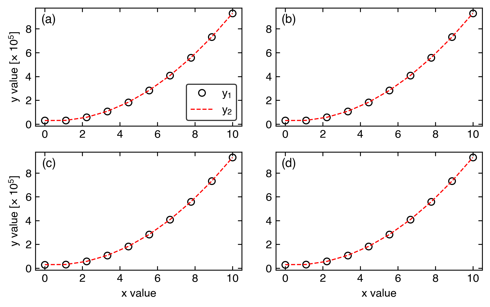
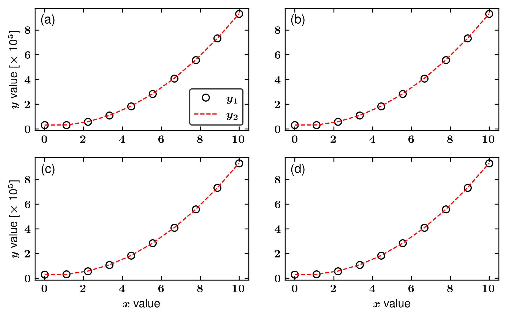

# columnplots
My personal python **matplotlib** wrapper for creating publication-level scientific figures with minimal effort.

- Dependence: A recent version of **numpy**, **matplotlib**, and **LaTeX**.

- Install: Include src/ folder as the **$PYTHONPATH** environment in .bashrc; or simply copy src/columnplots.py to the same folder as the plotting script.

- Example in examples/simple.py illustrates how to use this wrapper to reduce the code effort for generating the publication-level figures for scientific journals.

```python
import numpy as np
# our wrapper
import columnplots as clp

# turn this parameter to false if LaTeX is not installed
if_latex=False

# prepare x data for plotting
x = np.linspace(0, 10, 10)

# prepare y data for plotting
y = (x**2 - x + 3)*1e4

# prepare input values for scientific plotting
xs = [x]*2
ys = [y]*2
colors = ["ko", "r--"]
labels = ["$y_1$", "$y_2$"]

# do plotting

# 1. Initialize a 2x2 figure
axes = clp.initialize(col=2, row=2,
               width=6.4, height=6.4*0.618,
               LaTeX=if_latex,
               labelthem=True, labelsize=11, labelthemPosition=[0.1, 0.95],
               fontsize=10)

# 2. Plot each figure
clp.plotone(xs, ys, axes[0,0], labels=labels, colors=colors, lw=1,
            ylabel="$y$ value",  showlegend=True, legendloc="lower right",
            yscientificAtLabel=True)

clp.plotone(xs, ys, axes[0,1], labels=labels, colors=colors, lw=1, showlegend=False,
            yscientificAtLabel=True)

clp.plotone(xs, ys, axes[1,0], labels=labels, colors=colors, lw=1, showlegend=False,
            ylabel="$y$ value", xlabel="$x$ value",
            yscientificAtLabel=True)

clp.plotone(xs, ys, axes[1,1], labels=labels, colors=colors, lw=1, showlegend=False,
            xlabel="$x$ value",
            yscientificAtLabel=True)

# 3. tune the spacing between subplots and save file as example.png
clp.adjust(tight_layout=True, savefile="example.png")
```
After running this python script, we obtain the following figure:



If we set **if_latex=True**, the figure would be:



This wrapper has been used in several other Github projects, including
- https://github.com/TaoELi/cavity-md-ipi
- https://github.com/TaoELi/cavmd_examples_h2o
- https://github.com/TaoELi/cavmd_examples_co2
